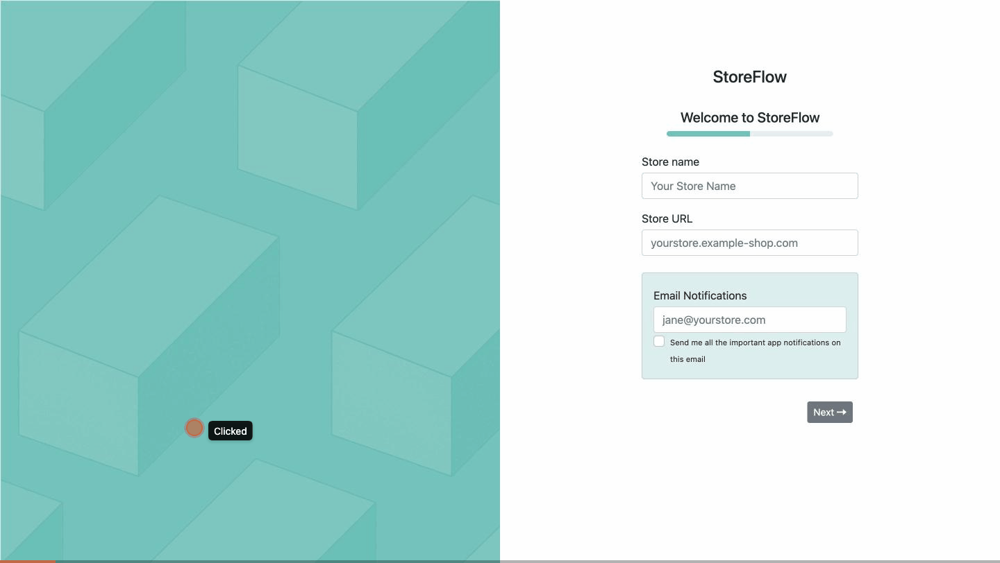

# StoreFlow — welcome flow

A multi-page HTML onboarding/welcome flow that could serve as the enter screen of
an app. Pure front end (no backend), **responsive** and **mobile first**.

The flow adapts to the user's state and only shows the relevant screens. The user
enters some information (store name, store URL, …). If the store URL ends with
`example-shop.com`, they pick from a set of radio options and then choose an
analytics destination; otherwise they answer the same options and go straight to
the final screen.



*Picking a profile, filling in the store details, answering the questionnaire, and — because the store URL ends in `example-shop.com` — landing on the analytics-destination choice.*

## Features

- Multi-page onboarding flow that branches on the store URL.
- State carried between pages via the URL hash and `sessionStorage`.
- Responsive, mobile-first layout (Bootstrap).
- Pure front end — no backend, no build step.

## How to install and run

1. Download the example or [clone the repo](https://github.com/Zabzuki/store-welcome-flow.git).
2. Install the [Live Server](https://marketplace.visualstudio.com/items?itemName=ritwickdey.LiveServer) extension.
3. Open `Start/start.html` and run Live Server (Go Live).
4. Ready to use.

## Architecture

```
Start/start.html → Store/store.html → ChoosingCheckbox/choosingCheckbox.html →

  if the URL contains `example-shop.com`:
      → ChooseDestination/chooseDestination.html
  else:
      → End/end.html
```

## Technologies

- HTML5
- CSS3
- JavaScript
- Bootstrap

## Notes

Each input value is stored in `sessionStorage`, which is what lets the next page
check whether the store URL ends with `example-shop.com` and branch accordingly.

## What was tricky

Deciding which storage to use (`localStorage`, `sessionStorage`, cookies) for
carrying the values between pages and checking the URL. `sessionStorage` fit best.

## Future changes

1. Validate input format (e.g. the email should contain `@`).
2. Add some basic unit testing.
3. Keep the entered values when navigating back.

## License

This project is licensed under the MIT License — see the [LICENSE](LICENSE) file.
